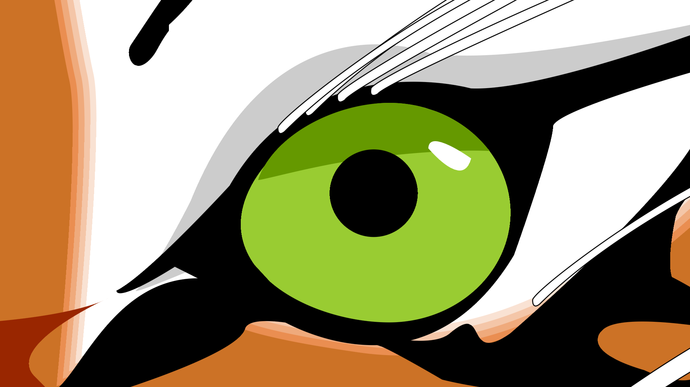

## Current Status

This project is not actively maintained. It works on my PC, and on my Raspberry Pi4.

If you want paid support, complete source code not just C# pieces, or port this to some other platforms, my e-mail is soonts@live.com

Be sure to check out Installation.md, EULA.txt, and "Pre-existing IP.txt" documents in this repository.

# Vrmac Graphics

Vrmac Graphics (pronounced “Vrmats” and named after [the mountain](https://en.wikipedia.org/wiki/Vrmac) in the immediate vicinity of my home) is a cross-platform graphics library for .NET core 2.1 or newer.

The mountain:


 
My ultimate goal is a rich GUI framework comparable to [UWP](https://docs.microsoft.com/en-us/windows/uwp/get-started/universal-application-platform-guide).
 
Initial scope is more modest. So far, the library does not implement GUI, it’s an immediate mode rendering library.

As for the cross-platform part, it only supports two platforms, Windows 10 with Direct3D 12, and [Raspberry Pi 4](https://www.raspberrypi.org/products/raspberry-pi-4-model-b/) with GLES 3.1.

I have only open sources .NET parts. The native library is shipped in binaries, with a permissive license which allows free use in any software  (attribution is required). Specifically, there’re 2 native binaries.

* One is `Vrmac.dll`, a 64-bit Windows DLL wraps Direct3D 12, runs on Windows 10, and compiled with Visual Studio 2017 15.9.23.
 
* Another one is `libVrmac.so`, 32-bit ARMv7 Linux DLL that wraps OpenGL ES 3.1, runs on Raspberry Pi 4, and compiled with GCC 8.3.0 in that Pi.

# 3D Related Features

## 3D GPU Abstraction Layer

For that part, I’ve forked [Diligent Engine](https://github.com/DiligentGraphics/DiligentEngine), Apache License 2.0 allows that, and modified it heavily.

I’ve found the project not long ago, and I liked the design a lot.
That find was the main reason why I started this project at all.
 
Apparently, they took the design of D3D12, and implemented it over the rest of the platforms.
They even cross-compile HLSL shaders into GLSL.
 
I believe their approach works much better than the other way, which is used in [Angle](https://en.wikipedia.org/wiki/ANGLE_(software)), [WebGL](https://en.wikipedia.org/wiki/WebGL) and others.
OpenGl is just too old and too broken by now. It was designed too long ago for different use cases and completely different hardware.
Even the [consortium](https://www.khronos.org/) has apparently concluded it’s broken beyond repair, and came up with Vulkan.
Vulkan is way better, but the hardware support is still lacking at the time of writing.

Linux FullHD:



Windows 4k:



The source geometry is from an STL file, per-vertex normals are generated automatically by the library.
 
### COM Interop

I’ve added support for [COM interop](https://github.com/Const-me/ComLightInterop) to Diligent.
I’ve wrote a code generator (based on [CppSharp](https://github.com/mono/CppSharp) which in turn is based on [LLVM](http://clang.llvm.org/docs/IntroductionToTheClangAST.html)) to parse Diligent’s header files,
and emit a huge pile of C# and C++ sources.

The generated C# code is in this repository.
The generated C++ code implements these COM interfaces. I’ve patched Diligent engine so their objects implement the combined set of the interfaces, both original and my generated ones.
Diligent engine uses reference counting just like COM, so the lifetime was simple.
However, the generated code still has to do non-trivial amount of boilerplate. Specifically, it marshals C++ exceptions into [HRESULT](https://docs.microsoft.com/en-us/openspecs/windows_protocols/ms-erref/0642cb2f-2075-4469-918c-4441e69c548a) codes, and exposes some additional APIs.

I could have built the required data structures in C#, using [Marshal.AllocHGlobal](https://docs.microsoft.com/en-us/dotnet/api/system.runtime.interopservices.marshal.allochglobal?view=netcore-2.1) or equivalents, but instead opted for more idiomatic API surface of the native library. Most notably, I’ve replaced `ShaderCreateInfo` and `PipelineStateDesc` structures with COM interfaces which build the required structures in native memory.
 
The COM API exposed by Windows and Linux versions is identical, but there’re couple differences in what’s supported.
GLES on Linux requires combined samplers, Windows won’t run GLSL shaders (HLSL shaders work on both), the two need slightly diffident perspective matrix formula.
Probably there’s more but still, these are minor differences.

### Other Changes

Diligent doesn’t implement [C preprocessor](https://en.wikipedia.org/wiki/C_preprocessor) for shaders, my fork does. I needed the feature to switch shaders input bindings and vertex layout with preprocessor macros.
While I was at it, implemented a few improvements to GLSL preprocessor, e.g. my fork appends `u` suffix to hexadecimal numbers in the HLSL source code, this was required because GLSL fails to automatically cast integers to unsigned.

Also fixed a few bugs here and there, mostly related to GLES support. For example, ResolveTextureSubresource was broken unless the destination texture is a fake one from a swap chain.

## Auxiliary Infrastructure

### Mode Setting

Modern Linux kernel is actually quite good at this. DRM/KMS APIs take some amount of boilerplate to setup. But the design is good, once implemented it works well, and very reliable in my experience.

The Linux version of the library supports 2 methods of operation: in a window on a desktop, and on top of the OS kernel. Unfortunately, the bare metal mode is incompatible with X windows.

If you want to test that mode, either flash the MicroSD card with an OS build without desktop, [Raspbian Buster Lite](https://www.raspberrypi.org/downloads/raspbian/), or boot to console using raspi-config.

### Window Handling
 
Windows runs WinAPI, the Linux I’m targeting uses X11.
The two are almost entirely different. Fortunately, I only needed a small subset of them, a bare minimum to create a 3D rendered window, and handle user input.
The exposed COM API is almost identical, apart from just a few differences, e.g. they use different way to configure swap chain formats.
 
### Dispatcher
 
GLES has limited support for multithreading. Even on Windows with it’s D3D12, there’re important things which have thread affinity: input focus, message queue, and others.
Fortunately, .NET Core does threads just fine,  I only needed to do the lowest level part, a [synchronization context](https://stackoverflow.com/a/18098557/126995).
 
On Windows the dispatcher is backed by [GetMessage](https://docs.microsoft.com/en-us/windows/win32/api/winuser/nf-winuser-getmessage) / [PeekMessage](https://docs.microsoft.com/en-us/windows/win32/api/winuser/nf-winuser-peekmessagew), and is very simple.
 
On Linux it’s implemented with [mq_receive](http://man7.org/linux/man-pages/man3/mq_receive.3.html) / [poll](https://linux.die.net/man/2/poll).
It’s more complicated there because IO is involved.
Linux version uses the same poll for X11 sockets, and for reading from raw input devices.

### Input

A good abstraction over mouse and especially keyboard, which works same way on all 3 platform (windows desktop, Linux desktop, Linux bare metal), took surprisingly long time to implement.
Linux doesn’t support Unicode which is absolute requirement for keyboard events.
Windows does, but the API is a bit tricky, here’s [a good overview](http://blog.ngedit.com/2005/06/13/whats-broken-in-the-wm_keydownwm_char-input-model/).

In windowed mode events come from the window manager of the OS.
For keyboard, they are `WM_CHAR` / `WM_KEYDOWN` / etc. on Windows, `xcb_key_press_event_t` / `xcb_key_release_event_t` on Linux.

In Linux full screen mode however, the events come from raw input devices.
As a consequence, in that mode I needed to implement keyboard layouts on my side. Currently, the library only supports 2 of them, US English and Montenegrin Latin layouts.
The raw input is almost entirely in C#, C++ only handles the low-level I/O.

## Higher Level Parts

### Vector Math Classes

Initially, the code is from [MonoGame](https://github.com/MonoGame/MonoGame). The project uses MS-PL licence, however the only 15 source files which I needed all say “MIT license” on the top. Reworked heavily since then.

If you wonder why I’m not using [System.Numerics](https://docs.microsoft.com/en-us/dotnet/api/system.numerics?view=netcore-2.1) — structures from there lack `[StructLayout( LayoutKind.Sequential )]` which is absolute requirement for native interop.
And given Microsoft’s stance on backward compatibility, not sure they ever fix it.

### Mouse Pointers

The library includes support for rendering pointers loaded from cursor files. It supports both static `*.cur` and animated `*.ani`.
It even supports rendering of monochrome static ones with that weird [(screen AND mask) XOR image](https://devblogs.microsoft.com/oldnewthing/20101018-00/?p=12513) blend mode. Did that in C#.

### Triangle Mesh Loading

The library implements indexing of non-indexed meshes ([STL](https://en.wikipedia.org/wiki/STL_%28file_format%29) meshes aren’t indexed), and high quality vertex normals generation. Did that in C++, the algorithms are CPU bound and benefit from SSE/NEON a lot.

### Timers and Animation

The C# part of the library implements comprehensive support for playing animations.

# 2D Graphics

The library implements two 2D backends.

1. **[Direct2D](https://docs.microsoft.com/en-us/windows/win32/direct2d/direct2d-portal)**, for obvious reason it only works on Windows. Trivially simple in C#, less so in the underlying Vrmac.dll, as Direct2D does not integrate into Direct3D 12, it can only render in D3D 11, so I had to write some code to make sense of what MS calls “[Direct3D 11 on 12](https://docs.microsoft.com/en-us/windows/win32/direct3d12/direct3d-11-on-12)”

2. **Vrmac Draw** works on both platforms. It’s better in some respects, Direct2D is very inefficient, they spam triangles for [AA](https://en.wikipedia.org/wiki/Multisample_anti-aliasing), they render stuff to textures,
and they use way too many draw calls. It’s worse in other respects however, this is mostly due to a lack of time, e.g. the only implemented brushes are solid color ones.
This one is implemented in C#, only the computation-heavy paths operations are in C++, see `iPathGeometry` COM interface.
That C++ code uses SIMD intrinsics a lot. For example, transforming 2D points with 3x2 matrix to compute bounding boxes only takes 3 CPU instructions per 2 points combined (i.e. 1.5 instructions/point on average).
This is true for both platforms.

`Vrmac.dll` supports both. To save a few milliseconds on startup, it uses [delay loading](https://docs.microsoft.com/en-us/cpp/build/reference/linker-support-for-delay-loaded-dlls?view=vs-2017) mechanism to link to D3D11 and Direct2D.
This should help users who don’t need 2D graphics, or don’t want Direct2D.
Because there’s no Direct2D on Linux, `libVrmac.so` only supports the built-in method for 2D.

Both backends expose almost identical API to users of the library, see `iDrawDevice` and `iDrawContext` C# interfaces. And they use the same high-level approach.
I didn’t want to experiment with GPU-based splines. AFAIK the research is not there just yet.
I did the same thing D2D is doing — tessellating splines to polylines as a first step, everything down the pipeline is processing polylines, or triangle meshes.

The only unfortunate difference, they use different conventions for brush colors. In Vrmac everything is premultiplied alpha, including brush colors,
Direct2D however [only uses straight alpha](https://docs.microsoft.com/en-us/windows/win32/direct2d/supported-pixel-formats-and-alpha-modes#about-premultiplied-and-straight-alpha-modes) for brushes.
Premultiplied alpha is almost always better, that’s why 2D devices have that unfortunate `iDrawDevice.premultipliedAlphaBrushes` property.

The Direct2D part is boring, it’s a thin COM wrapper around the underlying Windows API.
Apart from D3D 11 on 12 boilerplate, just a few pages of C++ code.
The rest of this section is about Vrmac Draw backend.

## Vector Graphics Engine

The library implements vector graphics engine on par with Direct2D.
It supports shapes made of polylines, quadratic Bézier patches, cubic Bézier patches, elliptical arcs, or any combination of the four.
I didn’t took [the shortcut](http://spencermortensen.com/articles/bezier-circle/) of approximating the arcs with Bézier patches, my arcs are truly elliptical.

Linux FullHD rendering:



Same image zoomed in, also on Linux:



Same image rendered on Windows 10 in 4k resolution:



All images above render fast enough for realtime use cases. On my Windows 10 PC I’m getting very smooth 60 FPS even in 4k.
On Pi 4, when zoomed in the framerate is not as great for that test image, but I don’t think I ever saw it dropping below 20 FPS in latest builds.
If 20 FPS is not good enough for your use case, just cache an output texture of your vector graphics.

### Filled Paths

The library supports self-intersecting paths, and implements both [fill modes](https://docs.microsoft.com/en-us/windows/win32/api/d2d1/ne-d2d1-d2d1_fill_mode). Thank to Mikko Mononen for [Libtess2](https://github.com/memononen/libtess2).

### Stroked Paths

The library supports [all 4 types](https://docs.microsoft.com/en-us/windows/win32/api/d2d1/ne-d2d1-d2d1_line_join) of line joins, and [all 4](https://docs.microsoft.com/en-us/windows/win32/api/d2d1/ne-d2d1-d2d1_cap_style) cap styles.

The library does **not** support dashed lines. Relatively easy to add them, by repeating 1D texture along the mesh.

The library doesn’t support self-intersecting stroked translucent lines particularly well. They will render, but the self-intersecting parts will have double the alpha.

### Brushes

Currently, the library only supports solid color brushes. Translucent colors are fine.

### VAA

Vrmac Draw implements high-quality anti-aliasing method which does not uses MSAA hardware.

VAA doesn’t rely on post-processing render pass like the rest of them (FXAA, MLAA, SMAA, etc).

It doesn’t rely on pre-processing render pass either.
Direct2D does just that BTW, it pre-renders individual paths into 512x512 R16\_UINT textures,
setting `forcedSampleCount` [field](https://docs.microsoft.com/en-us/windows/win32/api/d3d11_1/ns-d3d11_1-cd3d11_rasterizer_desc1) to 16, writes these 16-bit SV_Coverage values there, and reads from that texture on the main rendering pass.
Not only it’s slow, also not portable, AFAIK there’s no `forcedSampleCount` equivalent in GLES 3.1.

Instead, VAA achieves higher-quality AA (unlimited samples in theory, 256 samples in practice due to the precision of the output) with a single forward-only rendering pass. It requires no additional textures or buffers.

It requires substantial amount of mesh pre-processing. These algorithms are implemented in manually-vectorized C++ and run pretty fast.
This is true even on Raspberry Pi 4, thanks to [NEON](https://developer.arm.com/architectures/instruction-sets/simd-isas/neon) extension.
On PC I use [SSE](https://en.wikipedia.org/wiki/Streaming_SIMD_Extensions), all of them up to SSE 4.1, and also [FMA3](https://en.wikipedia.org/wiki/FMA_instruction_set).
In human language, this means you need a computer made in 2014+

The approach is only applicable to 2D graphics. Possible to implement for 3D as well, but (a) will very likely require a geometry shader.
At the time of writing, Pi4 doesn’t support them. (b) I’m not sure about the performance. Mesh generation algorithms build non-trivial mesh topologies, and have substantial amount of branching.
Not sure GPU is a good fit for code like that. Fortunately, I only wanted that thing for 2D.

### Text

Vrmac 2D backend supports high-quality text with ClearType-like subpixel rendering. Example from Linux:



If you download that image and zoom in, you’ll notice I disable ClearType when I detect the text is transformed.
The rotated “Hello World” text is rendered with grayscale AA, as opposed to ClearType. This is a performance optimization.
Generating bitmaps for every rotation angle gonna consume too much VRAM and memory bandwidth. Grayscale rendering allows to reuse bitmap for all rotation angles, for a reasonable quality cost.

### Limitations

To make it render fast enough on Pi4, I’m merging 2D draw commands into 2 draw calls, front-to-back opaque, and back-to-front translucent.
Filled meshes are opaque unless the brush has transparency, but stroked meshes are all translucent. Don’t abuse strokes too much if you want good performance.
For stroke widths much larger than 1 pixel after the transforms, consider converting your geometry to filled paths, they will render faster.

2D drawing invalidates depth buffer of the destination render target. If you want to render 3D content on top of 2D, call `IDeviceContext.ClearDepthStencil` after the disposal of `iImmediateDrawContext` object.

### Missing Pieces

The only way to render text is with Vrmac2D backend and FreeType: no DirectWrite integration is currently implemented.

Some features are missing, such as gradient or tiling bitmap brushes.
Both can be easily implemented in C# and HLSL only, on top of what I already did.

I have not yet used this in commercial software, therefore have not tested the code much. Probably has bugs.