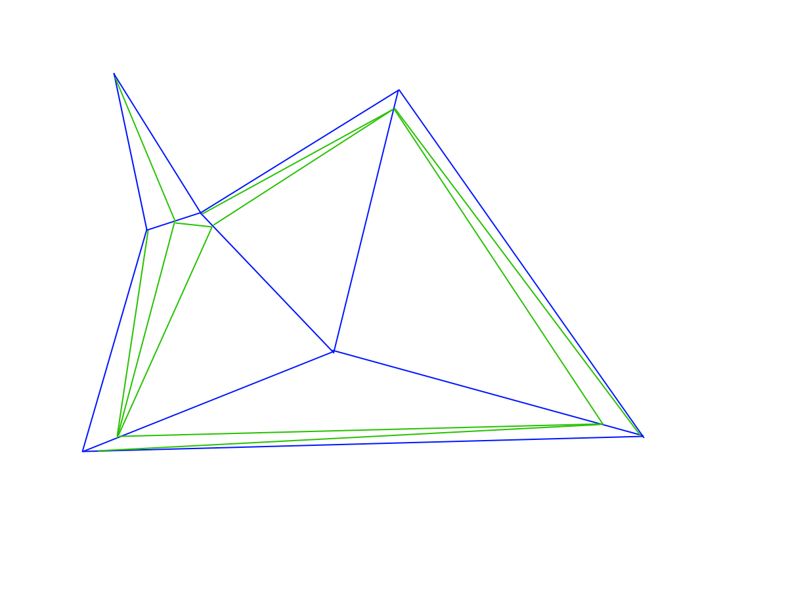
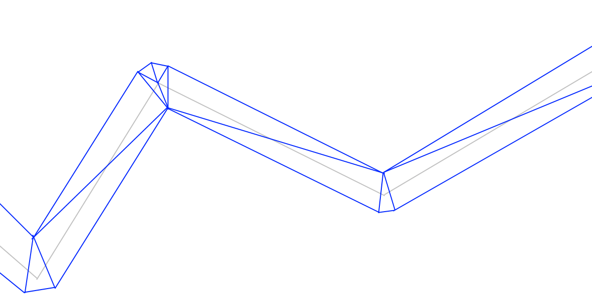

# Vrmac Anti-Aliasing

This document describes VAA algorithm used for 2D vector graphics in Vrmac Draw.

There’re multiple AA implementations there. 
You can enable Direct2D backend instead of Vrmac Draw, and there’s high quality LCD-aware font AA in FreeType.

This document is only related to rendering 2D vector graphics, and only when using the built-in Vrmac Draw backend.

## High Level Architecture

The upstream part of pipeline is quite similar to MS Direct2D.

Specifically, as a first step both libraries are converting splines into polylines, using precision derived from the shape’s current transformation matrix, and physical pixels density.

Then, they both are building triangular meshes from these polylines.

The last step however is different. Direct2D uses two-pass rendering, they first rendering each shape into `R16_UINT` texture with forced 16x MSAA, and a pixel shader which outputs `SV_Coverage` system-generated value into that texture. On the main pass, they read from that texture to get per-pixel AA values.
Therefore, they need at least 2 draw calls for every shape rendered.

Vrmac Draw renders the complete 2D scene in a single pass with just 2 draw calls. 
Initially I also used hardware MSAA BTW, but I quickly discovered even with low MSAA levels like 4, Raspberry Pi4 GPU is not remotely fast enough to render simple 2D at 60Hz/FullHD.

## Data Flow

1. User creates a [2D draw device](https://github.com/Const-me/Vrmac/blob/1.2/Vrmac/Draw/Main/DrawDevice.cs).

2. User creates various resources on that device, such as path geometries.
That data is copied from managed to unmanaged memory.
iVrmacDraw [COM interface](https://github.com/Const-me/Vrmac/blob/1.2/VrmacInterop/Draw/Render/iVrmacDraw.cs) serves as a factory. 
That object, nor any other C++ classes related to Vrmac Draw vector graphics, doesn’t touch GPU at all. 
The main reason why that code is written in C++ is missing support for NEON SIMD in .NET framework.
Even the current .NET 5 still doesn’t support NEON hardware intrinsics when running on ARMv7.
There’s some limited support when running on ARM64, but not the 32-bit one which was my target platform for this project.

3. User then sends these paths and brushes to render something by calling methods of [iDrawContext](https://github.com/Const-me/Vrmac/blob/1.2/Vrmac/Draw/iDrawContext.cs) interface.
At this point, the code still doesn’t touch the GPU, but the CPU starts processing these shapes right away.
The processing happens on background threads implemented by the .NET runtime, and vast majority of CPU time is spent running CPU-bound C++ code in the native DLL.
See [iTesselator interface](https://github.com/Const-me/Vrmac/blob/1.2/Vrmac/Draw/Tessellate/iTesselator.cs) for the API surface, and the rest of the ` *.cs` files in that subfolder for the implementation.

4. Finally, when user wants to present a frame they call Dispose() on the drawing context.
The [implementation is there](https://github.com/Const-me/Vrmac/blob/1.2/Vrmac/Draw/Main/ImmediateContext.api.cs#L228).
The code waits for all pending tessellation tasks, combines triangle meshes into a single vertex + index buffer in VRAM,
uploads per-draw call buffer, and finally submits up to 2 `DrawIndexed` calls to GPU, using same vertex/index buffers but different pipeline states and index ranges.

## Shaders

Shaders are in this repository, under MIT license:
[vertex shader](https://github.com/Const-me/Vrmac/blob/1.2/Vrmac/Draw/Shaders/drawVS.hlsl) and [pixel shader](https://github.com/Const-me/Vrmac/blob/1.2/Vrmac/Draw/Shaders/drawPS.hlsl).

When running on Linux, the GPU abstraction layer I’m using re-compiles these shaders from HLSL into GLSL, to render things with GLES instead of D3D12.

These two shaders are compiled multiple times each, with different set of preprocessor definitions.
Specifically, there’s [a cache](https://github.com/Const-me/Vrmac/blob/1.2/Vrmac/Draw/PipelineStates/StatesCache.cs) with pipeline state objects used by 2D rendering. 
If you only interested in VAA but not the rest of the 2D engine, the most important preprocessor switch is `OPAQUE_PASS`.

## Draw Calls

The complete 2D scene is rendered with 2 draw calls.

The first draw calls defines `OPAQUE_PASS=1` when compiling both shaders, and renders opaque-only triangles. 
The triangles in that part of the index buffer are in front to back order.
This saves millions of pixel shader invocation per frame due to early Z rejection inside GPUs.
When rendering opaque triangles, no VAA is happening, the code in the pixel shader is disabled by the macro.

The second draw call defines `OPAQUE_PASS=0` and renders translucent triangles in back to front order, to achieve correct alpha blending.
However, that render state still reads and tests Z buffer values. This way translucent triangles occluded behind opaque triangles should be rejected early, before running that relatively expensive pixel shader.

## Meshes

All 2D meshes are using [sVertexWithId structure](https://github.com/Const-me/Vrmac/blob/1.2/VrmacInterop/Draw/Render/geometryStructures.cs#L48-L61) for per-vertex data.

The structure takes 12 bytes of VRAM per vertex, and consists of float 2D coordinates, and one extra 32-bit integer.

The upper 24 bits of the extra integer contain 0-based index of the draw command within the draw call, this way I can merge very different draw commands (2D shapes, text glyphs, bitmaps, etc) in a single vertex/index buffer.

The draw call data is in [sDrawCallData](https://github.com/Const-me/Vrmac/blob/1.2/Vrmac/Draw/PipelineStates/sDrawCallData.cs) structure.
Each one takes 48 bytes of VRAM, but that’s OK because these structures are reused across many vertices belonging to the same input shapes.

## VAA Rendering Modes

The shaders support 4 distinct modes of operation for VAA. These values are defined in [eVaaKind enumeration](https://github.com/Const-me/Vrmac/blob/1.2/Vrmac/Draw/Shaders/eDrawCall.cs#L27-L33).

That value is set for every shape and uploaded to VRAM in `sDrawCallData` structure. 
When shapes are merged into single vertex/index buffer, each shape uses it’s own value for rendering.

1. `None` is obvious, it disables VAA.

2. `Filled` is used for filled shapes. 
The low byte of the per-vertex integer contains either 0 or 1. It’s set to 1 for vertices inside the mesh, and 0 for vertices on the outer edge of the mesh. 
The C++ code which makes these meshes subdivides triangles similar to the following illustration: 
. 
The blue stuff is the original mesh as produced by [Libtess2 library](https://github.com/memononen/libtess2). The green stuff is subdivision made by extra C++ code which, when VAA is enabled, runs immediately after Libtess2 tesselator. 
Only a small fraction of the screen-space pixels is occupied by the translucent triangles.
The majority of the area is inside triangles, and unless the brush has transparency, these triangles gonna go to the opaque part of the output mesh.
The shaders break when all 3 vertices of the triangle are outside ones, but C++ code is aware that’s why it split the thin triangle near the top left of the image into 2 pieces, inserting an inner vertex. 
For an isolated triangle, I think it gonna insert just 1 inner vertex at the triangle’s center of mass, and connect it to all 3 vertices of the triangle.

3. `StrokedFat` VAA mode is used for stroked lines which are at least 1 physical pixel thick after the transforms. 
The complete shape mesh goes into the translucent half of the output. The low byte of the per-vertex integer contains either 0, 1 or 2. 
0 means the vertex is on the left edge of the curve. 
1 means the vertex is inside the shape. 
2 means the vertex is on the right edge of the curve. 
The mesh looks more or less like the following illustration: 
. 
The light gray line is the input polyline, the blue triangular mesh is what I building from that data. 
If you wonder what happens at line endings where left edge becomes right one — I simply duplicate 1 vertex at every end, flipping VAA byte value of the copy. 
The exact shape and topology depends on many things: input data, desired resolution and DPI scaling, applied transform,
values in [sStrokeStyle structure](https://github.com/Const-me/Vrmac/blob/1.2/VrmacInterop/Draw/Path/sStrokeStyle.cs) and a few others like viewport clipping. 
I wasn’t able to find a good enough library which generates stroked meshes like that, that part is 100% custom C++ code.

4. `StrokedThin` VAA mode is used for stroked lines which areless than 1 pixel after the transforms. 
The mesh is exactly the same as for `StrokedFat` VAA mode, there’s minor differences in HLSL and C# code for that VAA mode.